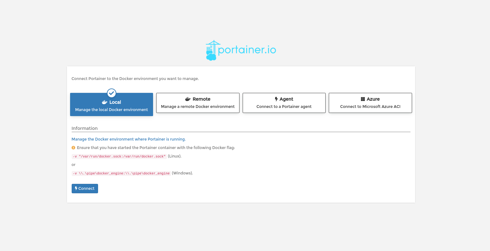
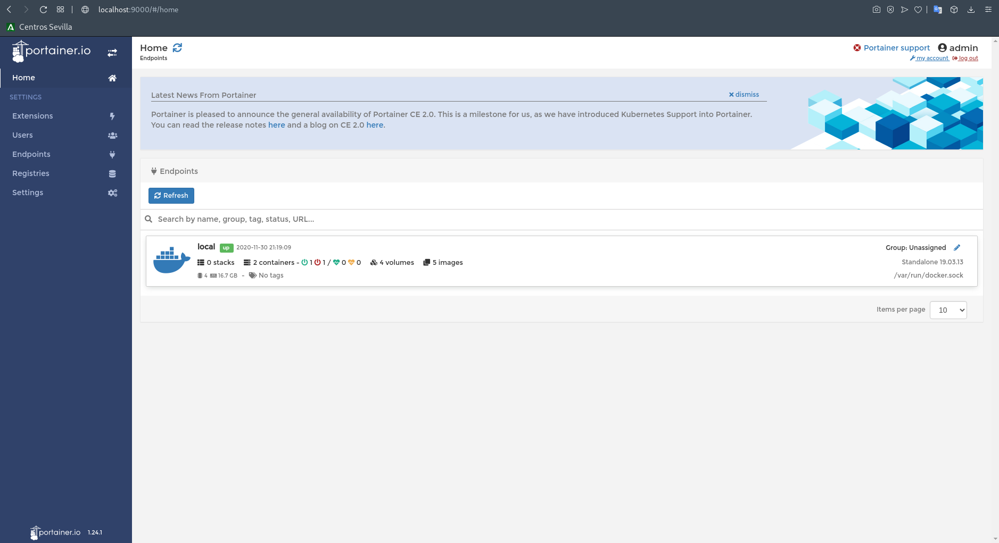

# 3.- Acceso
## Acceso

### Con el navegador accedemos a *http://localhost:9000*

#### Indicamos usuario y contraseña

#### Clicamos en *Local* y *Connect*

#### ¡Listo!

________________________________________
*[Volver al indice...](../README.md)*

