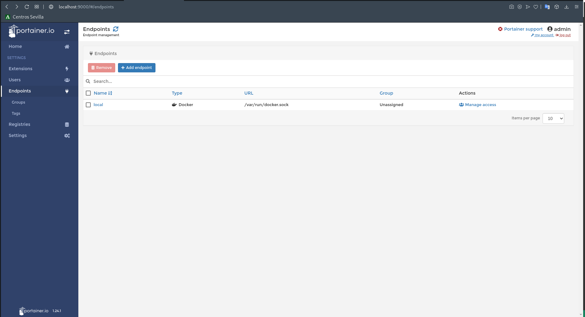

# 4.- Descripción del panel de control
## Descripción del panel de control.
### Home
En esta ventana del panel podemos ver información general: 
- Número de contenedores encendidos.
- Número de contenedores apagados.
- Versión de docker.
- Número de imágenes 
- Número de volúmenes.
- Versión de docker

Si tuviésemos más servidores de docker también se listarían en están ventana con sus respectivas caracteristicas...
### Extensions
En el panel Extensions tenemos la posibilidad de añadir extensiones las cuales nos faciliten el gestion de los contenedores, clusters, aprovisionamientos de estos etc ...

Muchas de estas son de pago...

### Users
En este ventana podremos crear,ver y eliminar los usuarios que tienen acceso a portainer

En este ventana podremos crear,ver y eliminar los usuarios que tienen acceso a portainer. Ademas tambien tenemos la posibilidad de crear roles y equipos organizativos

### Endpoints
Aquí podremos ver los distintos servidores desde los que podremos lanzar contenedores. En mi caso unicamente sale local que enlaza con los docker.sock *[Ver Instalación...](./instalacion.md)*
#### ¿Que es docker.sock?
> Se utiliza para comunicarse con el demonio principal de Docker mediante la API de Docker y la CLI de Docker para ejecutar comandos de Docker. Este socket también se puede usar para comunicarse con el demonio desde dentro de un contenedor. El demonio Docker puede escuchar solicitudes a través de tres tipos diferentes de socket: Unix, tcp y fd. De forma predeterminada, se crea un socket de dominio Unix (o socket IPC) en /var/run/docker.sock. — <https://dreamlab.net>
#### ¿Por qué montamos en un volumen docker.sock cuando levantamos la imagen de Portainer?

Si queremos en un contenedor pueda lanzar otros contenedores en nuestra máquina host, tenemos que darle acceso a la API o demonio de docker. Portainer es un gestor de contenedores el cual utilizará internamente los típicos comandos de docker que usamos en la CLI, estos son recogidos por el demonio de docker que es el realmente que efectuará los cambios en nuestra máquina.

> [!CAUTION]
> Para no dar permisos de root a los usuarios que tienen que trabajar con docker, estos se añaden al grupo de docker que se crea durante su instalación, y es el demonio de docker el que con privilegios de root ejecuta los cambios en el sistema(aquellos que han sido indicados por la CLI Ej: docker volume prune). Es de VITAL importancia para la seguridad de nuestro sistema que el contenedor que tenga acceso docker.sock sea confiable ya que estaríamos dando de manera indirecta privilegios de root sobre nuestro sistema a dicho contenedor, que nuestro caso, es portainer.

 

Si quieres profundizar en como añadir un endpoint visita [esta web](https://onthedock.github.io/post/170506-configura-un-endpoint-remoto-en-portainer/)
### Registries
### Settings
________________________________________
*[Volver al indice...](../README.md)*