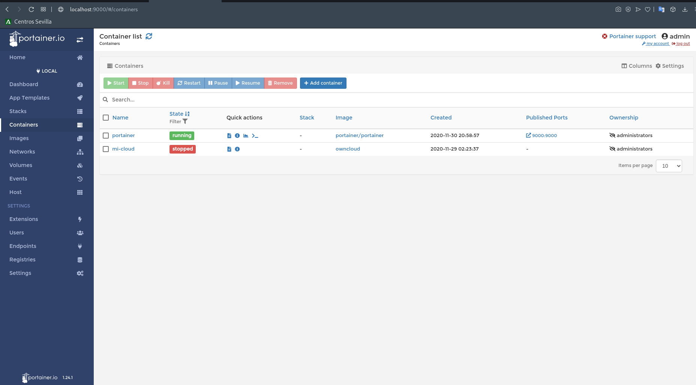
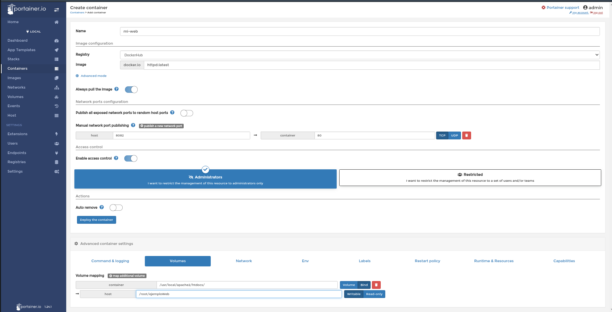
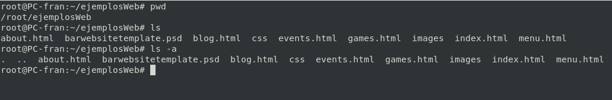
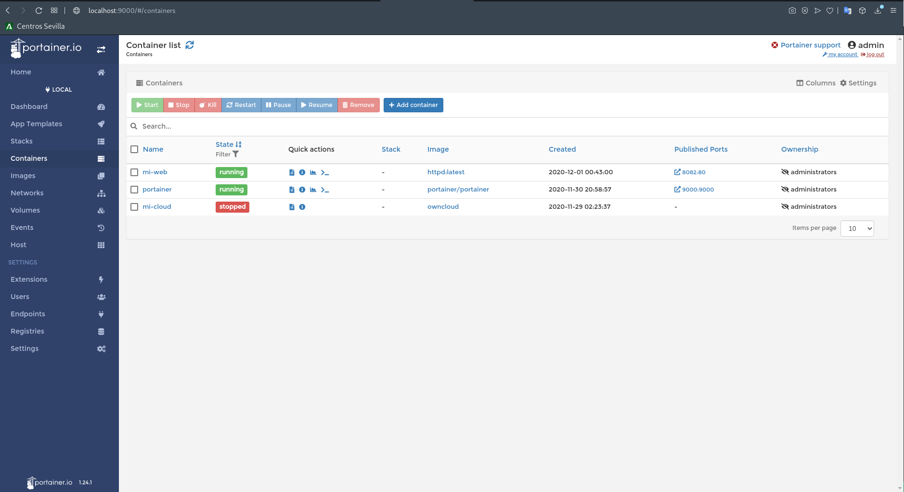

# 5.- Despliegue del contenedor
## Despliegue de un contenedor httpd con una paǵina personalizada y mapeaa por el puerto 8082.

**Home > Containers > + Add container**

**Creamos el contenedor**

Con esta configuración estamos creando un contenedor denominado *mi-web* partiendo de la imagen *httpd* de DockerHub, exponiendo este contenedor a través del puerto *8082*. Además estamos enlazado un directorio entre el host y el contenedor desde */root/ejemploWeb* (Donde estará mi web) a */usr/local/apache2/htdocs/* que es donde el servidor apache buscará la web a mostrar

*Contenido del directorio enlzado*

## Contenedor lanzado

________________________________________
*[Volver al indice...](../README.md)*