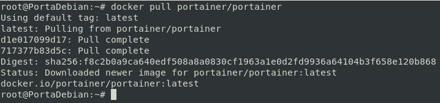
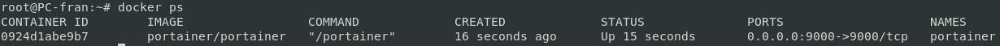

# 2.- Instalación

## Instalación del contenedor
Al bajarnos la imagen de DockerHub tendremos que especificar tambien el usuario ya que no es una imagen oficial de docker...

`docker pull portainer/portainer`

Levantamos la imagen con docker run...

`docker run -d --name portainer -p 9000:9000 -v /var/run/docker.sock:/var/run/docker.sock -v portainer_data:/data portainer/portainer`

Comprobamos que esta corriendo la imagen...

`docker ps`

________________________________________
*[Volver al indice...](../README.md)*